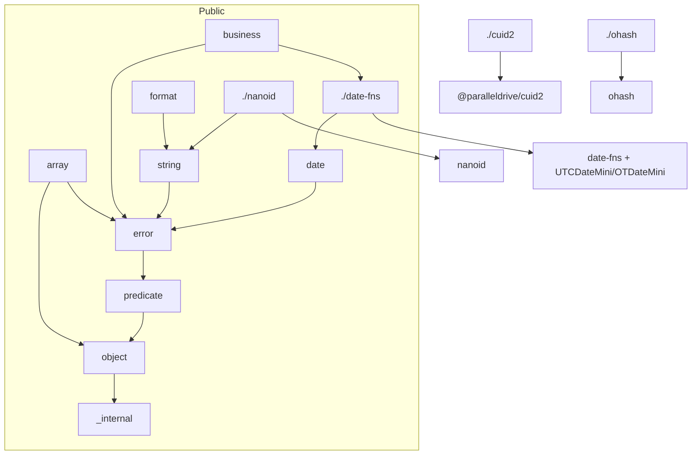

# `@xstools/utility` 架构

> 类似 lodash / es-toolkit 的基础工具库：自实现常用 API，并内置业务向能力与三方库统一出口。  
> ESM only · 构建 `tsdown` · 测试 `bun test` · 当前版本见 `packages/utility/package.json`

---

## 1. 设计要点

| 要点         | 做法                                                                              |
| ------------ | --------------------------------------------------------------------------------- |
| 强制子路径   | `package.json` 无 `"."`，也无根 `src/index.ts`；只能 `@xstools/utility/<subpath>` |
| 自实现优先   | 对标 es-toolkit / lodash API，不依赖它们                                          |
| 业务一等公民 | `business` / VIP 日期 / 中文星期等与通用工具同级                                  |
| 三方统一出口 | `_exports` + `devDependencies`，构建打进 `dist`                                   |
| 错误模型     | `error`（Tagged Error：`_tag` + 静态 `is()`）                                    |

```ts
import { difference, weightedSample } from '@xstools/utility/array';
import { ParamError, isTaggedError } from '@xstools/utility/error';
import { format, ot, OTDateMini, utc, UTCDateMini } from '@xstools/utility/date-fns';
import { parseOffset, getTimezoneOffset } from '@xstools/utility/date';
import { cuid2 } from '@xstools/utility/cuid2';
```

硬性约定另见：`.agents/rules/package.md`（发布 / 子路径 / 三方依赖）、`.agents/rules/code.md`（`===`、`function` vs `const`）。

---

## 2. 目录与发布边界

```
packages/utility/
├── package.json          # 仅子路径 exports
├── tsdown.config.ts      # 与 exports 一一对应的多入口
├── src/
│   ├── _exports/         # 三方 vendoring（发布为 ./cuid2 等）
│   ├── _internal/        # 包内私有：实现 + 测试夹具（不发布）
│   ├── array/
│   ├── business/
│   ├── date/
│   ├── error/
│   ├── format/
│   ├── object/
│   ├── predicate/
│   ├── promise/
│   ├── string/
│   └── util/
└── dist/                 # files: ["dist"]，唯一发布内容
```

| 位置 | 发布 | 说明 |
| --- | --- | --- |
| `src/{array,business,...}/` | ✅ 子路径 | 一等公民 API |
| `src/_exports/*` | ✅ 映射为 `./cuid2` 等 | 三方统一出口 |
| `src/_internal/` | ❌ | `pathToSegments`、`stub*`、`toArgs`、`constants` 等；禁止公开子路径 |

`tsdown` entry 与 `package.json` `exports` 对齐，**不含** `_internal`。

### 包内依赖



---

## 3. 双层模块

### 3.1 自实现域（`src/<domain>/`）

- 一文件一主 API（或同主题多导出）+ 域级 `index.ts` barrel
- 无 runtime `dependencies` / `peerDependencies`
- JSDoc 常带 `Reference(s)` 指向 es-toolkit / lodash 等

### 3.2 Vendoring（`src/_exports/`）

三方放在 **devDependencies**，构建打进产物；消费方只依赖本包。

| 子路径       | 形态        | 说明                                                      |
| ------------ | ----------- | --------------------------------------------------------- |
| `./cuid2`    | 薄封装      | `cuid2` / `createCuid2` / `isCuid2`；`cuid2(length?)` 仅正整数覆盖默认长度 |
| `./nanoid`   | 预配置      | `DIC_ALPHANUMERIC`、长度 21                               |
| `./ohash`    | 精选再导出  | `hash` / `serialize` / `isEqual` / `digest`               |
| `./date-fns` | 全量 + 扩展 | `date-fns` + `utc`/`UTCDateMini` + `ot`/`OTDateMini` + `extends`（区间重叠等） |

`./date-fns` 体量大，按需命名导入。`ot` / `OTDateMini` 依赖 `./date` 的 `parseOffset`。

---

## 4. 公开 API

### `./array`

| 符号                                             | 用途                                         |
| ------------------------------------------------ | -------------------------------------------- |
| `difference` / `differenceBy` / `differenceWith` | 差集                                         |
| `groupBy`                                        | 按 key 分组                                  |
| `head`                                           | 首元素（重载）                               |
| `rankByPath`                                     | 按路径排序并写入名次字段（默认 `_rank`，可自定义） |

| `sample` / `weightedSample`                      | 均匀 / 加权随机取样；非法权重抛 `ParamError` |
| `xor`                                            | 对称差（两数组）                             |

### `./business`

| 符号 | 用途 |
| --- | --- |
| `oid` | 20 位业务 ID |
| `addVipDays` | VIP 到期按业务 offset 延长 / 扣减；非法入参 → `ParamError` |
| `cnWeekDay` | ISO 日期 → 中文「周x」（UTC 日历日）；非法 → `ParamError` |
| `ossImageCrop` | 阿里云 OSS 图片裁剪 query |
| `getDistrict` / `isDistrictAcceptable` / `addressTrimParenthesis` / `addressTrimEnd` | 中文地址区划 |
| `getDistance` | Haversine 距离（米）；非 number / 非有限抛 `ParamError` |

### `./date`

| 符号                | 用途                                               |
| ------------------- | -------------------------------------------------- |
| `parseOffset`       | 固定 offset 字符串 → 分钟；非法抛 `ParamError` |
| `parseStrictISOString` / `toEpoch` | 严格瞬时 ISO → epoch；非法格式抛 `ParamError`（不校验日历） |
| `getTimezoneOffset` | 当前系统偏移，如 `+08:00`（可信度由调用方把控） |

> `areIntervalsOverlap(s)` 在 `@xstools/utility/date-fns`。日初/月初用 `startOfDay`/`startOfMonth` + `{ in: ot(offset) }`。

### `./error`

Tagged Error：`_tag` + 静态 `is()`，跨包识别。

| 符号                                                        | 用途         |
| ----------------------------------------------------------- | ------------ |
| `createTaggedError` / `isTaggedError` / `ITaggedError`      | 工厂与协议   |
| `LogicError` / `ParamError` / `AbortError` / `TimeoutError` | 预置领域错误 |

`AbortError` / `TimeoutError` 仅名称与 DOM / es-toolkit 相近，应用 `.is` / `isTaggedError` 识别，不要靠 `err.name`。

### `./format`

| 符号                            | 用途                |
| ------------------------------- | ------------------- |
| `formatBytes`                   | 字节可读化；非法 → `'0 B'`；`{ decimals? }` |
| `formatCurrency`                | 分 → 元（默认 `¥`）；非有限按 `0` 处理       |
| `starlizeName` / `starlizeCard` | 姓名 / 卡号脱敏；`MaybeString`              |

### `./object`

| 符号                  | 用途                                                                           |
| --------------------- | ------------------------------------------------------------------------------ |
| `get`                 | 深路径取值（重载；path 不为数组）                                               |
| `getTag`              | `Object.prototype.toString` 风格 tag                                           |
| `merge` / `mergeWith` | 深合并，原地改 target；默认同型递归、异型 source 赢并 clone；`undefined` 不覆盖已有值 |
| `omitBy`              | 按谓词剔除自有可枚举属性                                                        |
| `pick`                | 按 key 列表取自有属性                                                          |
| `shake`               | 默认剔除 `undefined`；可自定义谓词                                             |

与 lodash / es-toolkit 的行为对照见 `.agents/docs/merge.md`（交互页 `.agents/docs/merge.html`）。

### `./predicate`

| 符号                                                   | 用途                                |
| ------------------------------------------------------ | ----------------------------------- |
| `isArguments` / `isEmpty` / `isError` / `isObjectLike` | 类型 / 空值（`isEmpty` 含 Map/Set） |

### `./promise`

| 符号    | 用途         |
| ------- | ------------ |
| `sleep` | Promise 延时 |

### `./string`

| 符号                                | 用途                                               |
| ----------------------------------- | -------------------------------------------------- |
| `case*` / `capitalize` / `getWords` | 命名风格与分词                                     |
| `trim` / `trimStart` / `trimEnd`    | 可指定字符集                                       |
| `subString`                         | Unicode code point 截取；非 string 抛 `ParamError` |
| `template`                          | `{{ key }}` 模板                                   |
| `MaybeString`                       | `string \| null \| undefined`；只吞 nullish        |
| `DIC_*`                             | 字符表常量                                         |
| `uuid25encode` / `uuid25decode`     | UUID ↔ 25 位 base36；非法输入抛 `LogicError`       |

### `./util`

| 符号                       | 用途                                        |
| -------------------------- | ------------------------------------------- |
| `attempt` / `attemptAsync` | try/catch → `[err, null] \| [null, result]` |

### Vendoring 子路径

见 §3.2；导入形如 `@xstools/utility/cuid2`、`@xstools/utility/date-fns` 等。

---

## 5. 错误模型

统一使用 `./error`（Tagged Error）：

| 维度 | 约定 |
| ---- | ---- |
| 形态 | `createTaggedError(tag)` 的 `Error` 子类 |
| 身份 | `_tag` + 静态 `is()` / `isTaggedError` |
| 语义 | 逻辑 / 参数 / 中止 / 超时 |
| 导出 | 具名类 + factory |

包内：`getDistance` / `cnWeekDay` / `addVipDays` / `weightedSample` / `subString` → `ParamError`；`areIntervalsOverlap`（`./date-fns`）→ `ParamError`；`uuid25` → `LogicError`。

---

## 6. 代码约定

### 参数

- 主数据用位置参数；可选配置：**≤2 个可选尾参用位置参数**，**≥3 个相关字段用对象参数**（例：`formatBytes(n, { decimals: 2 })`、`formatCurrency(n, { decimals, symbol, sign })`）
- 例外：`Error` 标准 `ErrorOptions`、`_exports` 再导出的上游签名

### 组织

- 一文件一主 API；同主题可同文件（如 `case.ts`、`trim.ts`、`basic.ts`）
- 每域 `index.ts`：`export *`
- 私有实现与测试夹具放 `_internal`，不进公开 barrel

### 命名

| 类型     | 约定                                      | 示例                                          |
| -------- | ----------------------------------------- | --------------------------------------------- |
| 函数文件 | camelCase，**与主导出同名**               | `groupBy.ts`、`cnWeekDay.ts`、`parseOffset.ts` |
| 类文件   | PascalCase，与类名同名                    | `UTCDateMini.ts`、`OTDateMini.ts`             |
| 主题聚合 | 短名 camelCase（同文件多导出时）          | `case.ts`、`trim.ts`、`intervalsOverlap.ts` |
| 私有     | `_` 前缀                                  | `_exports/`、`_internal/`、`uuid25/_utils.ts` |

禁止 kebab-case 实现文件名（如 `cn-week-day.ts`）。

### 测试与文档

- `*.spec.ts` 与源文件并列；`bun test`
- JSDoc：说明 + `@param` / `@returns` / `@example`（`// =>`）；通用工具偏英文，业务偏中文

---

## 7. 构建与发布

- `format: ['esm']`，`dts` / `sourcemap` / `treeshake` / `clean`
- 三方构建期打入 `dist`（无 runtime deps）
- `files: ["dist"]`，`publishConfig.access: public`

---

## 8. 扩展清单

1. 放入对应域，优先一文件一函数，文件名与导出同名
2. 域 `index.ts` 增加 `export *`
3. 新域：同步改 `package.json` `exports` 与 `tsdown.config.ts` entry
4. 旁路 `*.spec.ts` + JSDoc
5. 私有逻辑 → `_internal`；不要加 `/_internal` 公开子路径
6. Vendoring → `_exports/<name>` + `devDependencies`，确认打进 dist
7. 有公开行为变化时按 `.agents/rules/package.md` 写 changeset
